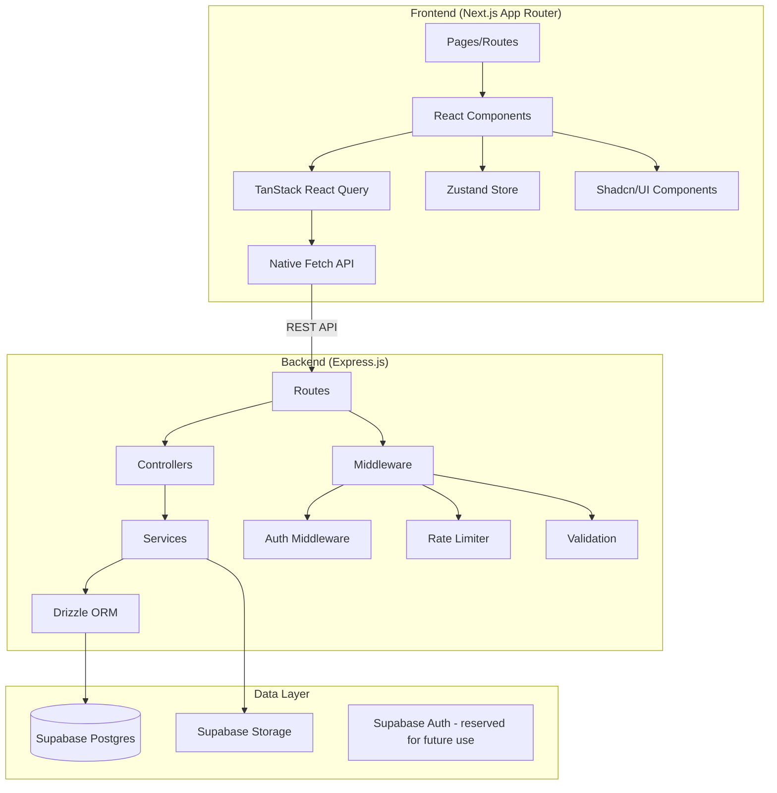
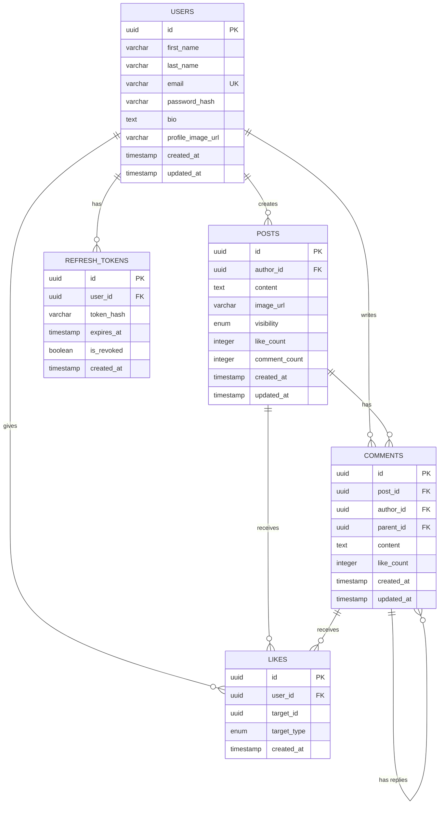

# BuddyScript — Social Feed Application
## Product Requirements Document (PRD)

---

| Attribute          | Details                                     |
|--------------------|---------------------------------------------|
| Document Version   | 1.0                                         |
| Created            | April 2026                                  |
| Author             | Asiful (Full Stack Engineer Candidate)      |
| Status             | Final                                       |
| Stack              | Next.js (App Router) + Express.js + Supabase|

---

## Table of Contents

1. [Introduction and Product Overview](#1-introduction-and-product-overview)
2. [Scope and Assumptions](#2-scope-and-assumptions)
3. [User Roles and Authentication/Authorization](#3-user-roles-and-authenticationauthorization)
4. [Core Features](#4-core-features)
5. [Non-Functional Requirements](#5-non-functional-requirements)
6. [Technical Architecture and Stack](#6-technical-architecture-and-stack)
7. [Data Models and Schema](#7-data-models-and-schema)
8. [API Endpoints](#8-api-endpoints)
9. [UI/UX Guidelines](#9-uiux-guidelines)
10. [Best Practices and Time-Saving Measures](#10-best-practices-and-time-saving-measures)
11. [Risks, Dependencies, and Timeline Outline](#11-risks-dependencies-and-timeline-outline)
12. [Appendices](#12-appendices)

---

## 1. Introduction and Product Overview

### 1.1 Purpose

BuddyScript is a full-stack social feed application built as a selection task for a Full Stack Engineer position at Appifylab. The application converts three provided static HTML pages (Login, Registration, Feed) into a fully functional, production-grade social platform using Next.js and Express.js.

### 1.2 Goals

| Goal                  | Description                                                                 |
|-----------------------|-----------------------------------------------------------------------------|
| **Functional MVP**    | Deliver a working social feed with auth, posts, comments, replies, likes    |
| **Clean Architecture**| Demonstrate professional code organization and type safety                  |
| **Security First**    | Implement JWT-based auth with access/refresh tokens and silent refresh      |
| **Scale-Ready Design**| Architecture capable of handling millions of posts and reads                |
| **Portfolio Quality** | Impress recruiters with clean code, performance, and UX                     |

### 1.3 Target Users

- **General users**: Anyone who registers to create posts, interact with content, and maintain a profile
- **Evaluators/Recruiters**: Technical reviewers assessing code quality, architecture, and feature completeness

### 1.4 Success Metrics (MVP)

| Metric                          | Target                           |
|---------------------------------|----------------------------------|
| Auth flow completion            | Register → Login → Feed in < 3s |
| Feed load time (first paint)    | < 2 seconds                      |
| Cursor-based pagination latency | < 500ms per page                 |
| Lighthouse Performance score    | ≥ 85                             |
| Zero critical security vulns    | OWASP Top 10 mitigated           |
| Test coverage (critical paths)  | ≥ 70%                            |

---

## 2. Scope and Assumptions

### 2.1 In-Scope (MVP)

| Feature Area              | Details                                                        |
|---------------------------|----------------------------------------------------------------|
| Authentication            | Email/password registration and login, JWT system              |
| User Profile              | View/edit profile info, profile image upload, password change  |
| Feed Page                 | Create posts (text + image), list posts newest-first           |
| Post Visibility           | Public posts (visible to all) and Private posts (author-only)  |
| Likes / Unlike            | Like/unlike on posts, comments, and replies                    |
| Comments                  | Add comments to posts                                          |
| Replies                   | Reply to comments                                              |
| Who Liked                 | Show list of users who liked a post/comment/reply              |
| Cursor-Based Pagination   | Infinite scroll feed using cursor-based pagination             |
| Dark Mode                 | Theme toggle (light/dark) matching provided design             |
| Responsive Design         | Desktop 3-column layout + mobile bottom nav + adaptive layouts |

### 2.2 Out-of-Scope (MVP)

| Feature                      | Reason                                         |
|------------------------------|-------------------------------------------------|
| Real-time notifications      | Not required per task; can add in v2            |
| Messaging / Chat             | Not required per task scope                     |
| Friend requests / Connections| Not required; feed shows all public posts       |
| Stories feature              | Visible in HTML but not in task requirements    |
| Events / Groups              | Left sidebar elements; not required for MVP     |
| Share functionality          | Not in required features                        |
| Forgot password              | Task says "no need" but notes "we will build it"; **include basic email reset flow** |
| Admin dashboard              | No admin role specified                         |
| Search functionality         | Not in required features list                   |
| Bookmarks / Save post        | Not in required features list                   |

### 2.3 Assumptions

- The provided HTML/CSS design must be followed exactly — no alternative designs
- "Millions of posts and reads" is an architectural consideration, not a load-testing requirement
- Google OAuth button is rendered as a **non-functional placeholder** in the UI (matching the HTML design) but has no backend implementation — email/password is the only auth method
- Supabase free tier is sufficient for MVP demonstration
- Single-developer execution within a tight timeline

---

## 3. User Roles and Authentication/Authorization

### 3.1 User Role

There is a single user role: **Authenticated User**. All authenticated users can create posts, comment, reply, like content, and manage their own profile.

| Permission               | Unauthenticated | Authenticated |
|--------------------------|:-:|:-:|
| View login / register    | ✅ | ❌ (redirect to feed) |
| View feed                | ❌ | ✅ |
| Create post              | ❌ | ✅ |
| Like / Unlike            | ❌ | ✅ |
| Comment / Reply           | ❌ | ✅ |
| View / Edit own profile  | ❌ | ✅ |
| View others' public posts| ❌ | ✅ |
| View private posts       | ❌ | ✅ (own posts only) |
| Delete own posts         | ❌ | ✅ |
| Edit own posts           | ❌ | ✅ |

### 3.2 Authentication Flows

#### 3.2.1 Registration Flow (Email/Password)

```
1. User navigates to /register
2. Enters: first_name, last_name, email, password, confirm_password
3. Accepts terms & conditions checkbox
4. Client validates:
   - Email format
   - Password minimum 8 chars, at least 1 uppercase, 1 number, 1 special
   - Passwords match
5. POST /api/auth/register
6. Server:
   a. Check email uniqueness
   b. Hash password (bcrypt, cost factor 12)
   c. Create user record in DB
   d. Generate access token (JWT, 15min expiry)
   e. Generate refresh token (JWT, 7-day expiry)
   f. Set refresh token as httpOnly secure cookie
   g. Return access token + user data in response body
7. Client stores access token in memory (NOT localStorage)
8. Redirect to /feed
```

#### 3.2.2 Login Flow (Email/Password)

```
1. User navigates to /login
2. Enters: email, password
3. Optional: "Remember me" checkbox
4. POST /api/auth/login
5. Server:
   a. Look up user by email
   b. Compare password hash (bcrypt)
   c. If "remember me": refresh token expiry = 30 days, else 7 days
   d. Generate access token (15min) + refresh token
   e. Set refresh token as httpOnly secure cookie
   f. Return access token + user data
6. Client stores access token in memory
7. Redirect to /feed
```

#### 3.2.3 Google OAuth (Placeholder Only)

> **Note:** The Google sign-in/register buttons are rendered in the UI to match the provided HTML design, but they are **non-functional dummy buttons**. Clicking them displays a toast/message: "Google authentication coming soon." No backend implementation is required.

This keeps the UI faithful to the provided design without spending development time on OAuth integration.

#### 3.2.4 JWT Token Strategy

| Token         | Storage              | Expiry   | Purpose                       |
|---------------|----------------------|----------|-------------------------------|
| Access Token  | In-memory (JS var)   | 15 min   | API authorization (Bearer)    |
| Refresh Token | httpOnly cookie      | 7–30 days| Silent refresh of access token|

**Silent Refresh Mechanism:**

```
1. On app load (or when access token expires):
   POST /api/auth/refresh (cookie auto-sent)
2. Server validates refresh token from cookie
3. If valid:
   a. Issue new access token
   b. Rotate refresh token (issue new, invalidate old)
   c. Return new access token
4. If invalid:
   a. Clear cookie
   b. Return 401
   c. Client redirects to /login
```

**Token Rotation:** Every refresh issues a new refresh token and invalidates the old one. This limits the damage window from stolen refresh tokens.

**Logout Flow:**

```
POST /api/auth/logout
1. Invalidate refresh token in DB
2. Clear httpOnly cookie
3. Client clears access token from memory
4. Redirect to /login
```

#### 3.2.5 Route Protection

| Route Pattern       | Access                                 |
|---------------------|----------------------------------------|
| `/login`            | Public only (redirect to `/feed` if authenticated) |
| `/register`         | Public only (redirect to `/feed` if authenticated) |
| `/feed`             | Protected (redirect to `/login` if unauthenticated)|
| `/profile`          | Protected                              |
| `/profile/edit`     | Protected                              |
| `/api/*`            | Protected (except auth endpoints)      |

### 3.3 User Profile System

**Profile Data:**

| Field            | Type     | Editable | Required |
|------------------|----------|:--------:|:--------:|
| first_name       | string   | ✅       | ✅       |
| last_name        | string   | ✅       | ✅       |
| email            | string   | ❌       | ✅       |
| bio              | text     | ✅       | ❌       |
| profile_image    | file/url | ✅       | ❌       |
| created_at       | datetime | ❌       | auto     |

**Profile Features:**
- View own profile page with all user information
- Edit profile information (first name, last name, bio)
- Upload/change profile image (stored in Supabase Storage)
- Change password (requires current password confirmation)
- View own posts on profile page

---

## 4. Core Features

### 4.1 Feed Page

The feed page is the primary screen of the application, accessible only to authenticated users. It displays posts from all users in reverse-chronological order.

#### 4.1.1 Post Creation

| Feature              | Specification                                                |
|----------------------|--------------------------------------------------------------|
| Text content         | Required (or image must be present), max 5000 chars          |
| Image attachment     | Optional, single image, max 5MB, formats: jpg/png/gif/webp   |
| Visibility selector  | Dropdown: "Public" (default) or "Private"                    |
| Submit button        | "Post" button, disabled until valid content provided         |
| Author avatar        | Current user's profile image shown beside textarea           |
| Composer location    | Top of feed, below story cards area                          |

**Post Composer UI (from `feed.html` analysis):**
- User avatar on the left
- Floating textarea with placeholder "Write something ..."
- Bottom action bar with: Photo (image upload), Video (disabled/MVP), Event (disabled/MVP), Article (disabled/MVP)
- "Post" button (blue icon with send arrow) on the right

#### 4.1.2 Post Display

Each post card includes:

| Element              | Description                                                  |
|----------------------|--------------------------------------------------------------|
| Author avatar        | Circular profile image, links to author's profile            |
| Author name          | Bold text, links to author's profile                         |
| Timestamp            | Relative time ("5 minutes ago")                              |
| Visibility badge     | "Public" or "Private" text link                              |
| Options menu (⋮)     | Dropdown: Save Post, Turn On Notification, Hide, Edit Post, Delete Post (edit/delete only for own posts) |
| Post text            | Full text content with optional "read more" for long posts   |
| Post image           | Full-width image below text (if attached)                    |
| Reaction summary     | Row of liker avatars + count (e.g., "9+")                   |
| Engagement stats     | "12 Comment" and "122 Share" counts                          |
| Reaction bar         | Like/Unlike (emoji button), Comment, Share buttons           |
| Comment input        | Avatar + textarea + mic icon + image icon                    |
| Previous comments    | "View 4 previous comments" expand button                    |
| Comment thread       | Comment with: avatar, name, text, reaction icons, count, Like/Reply/Share links, timestamp |
| Reply input          | Nested comment input under each comment                      |

#### 4.1.3 Like / Unlike System

| Target     | Behavior                                                     |
|------------|--------------------------------------------------------------|
| Post       | Toggle like/unlike; update count in real-time on client      |
| Comment    | Toggle like/unlike on individual comments                    |
| Reply      | Toggle like/unlike on individual replies                     |
| Who Liked  | Click on like count to see list of users who liked           |

**Like States (from HTML analysis):**
- Liked state: Highlighted emoji button (e.g., "Haha" reaction with yellow emoji SVG), active CSS class `_feed_reaction_active`
- Unliked state: Default outline style

> **MVP Simplification:** Use simple like/unlike toggle (thumbs up) instead of multiple reaction types (haha, love, etc.). The HTML shows reaction emojis but task only requires "like/unlike state."

#### 4.1.4 Comment System

| Feature          | Specification                                               |
|------------------|-------------------------------------------------------------|
| Add comment      | Text input below post; submit on Enter or button click      |
| Comment display  | Author avatar + name + text + reactions count + timestamp   |
| Comment actions  | Like, Reply, Share (Like and Reply functional for MVP)      |
| Timestamp        | Relative time (e.g., ".21m")                                |
| Reaction icons   | Thumbs up + heart count display on each comment             |

#### 4.1.5 Reply System

| Feature          | Specification                                               |
|------------------|-------------------------------------------------------------|
| Reply trigger    | Click "Reply" on any comment                                |
| Reply input      | Nested textarea appears below the comment                   |
| Reply display    | Indented under parent comment with same component structure  |
| Reply actions    | Like on replies; nested reply input                         |

#### 4.1.6 Post Visibility

| Type      | Behavior                                                     |
|-----------|--------------------------------------------------------------|
| Public    | Visible to all authenticated users in the feed               |
| Private   | Visible only to the post author; hidden from others' feeds   |

**Implementation:**
- Feed query filters: `WHERE visibility = 'public' OR author_id = current_user_id`
- Visibility shown as label next to timestamp on each post
- Default visibility for new posts: Public

#### 4.1.7 Cursor-Based Pagination

```
GET /api/posts?cursor=<last_post_id>&limit=10

Response:
{
  "posts": [...],
  "nextCursor": "uuid-of-last-post" | null,
  "hasMore": true | false
}
```

**Why cursor-based (not offset-based):**
- Stable results when new posts are inserted (no skipping/duplication)
- Consistent performance regardless of page depth (O(1) vs O(n))
- Required for infinite scroll UX
- Handles "millions of posts" requirement efficiently

**Implementation Details:**
- Cursor = `created_at` timestamp + `id` composite for deterministic ordering
- Posts ordered by `(created_at DESC, id DESC)`
- WHERE clause: `(created_at, id) < (cursor_created_at, cursor_id)`
- Index: `CREATE INDEX idx_posts_feed ON posts (created_at DESC, id DESC)`

### 4.2 User Profile Page

| Section           | Elements                                                     |
|-------------------|--------------------------------------------------------------|
| Header            | Cover area (optional), profile image, full name, bio         |
| Profile info      | Email (display only), member since date                      |
| Edit button       | Opens edit modal/page for name, bio, profile image           |
| Password change   | Separate form: current password, new password, confirm       |
| User's posts      | Feed of the user's own posts (public and private)            |

### 4.3 Dark Mode

- Toggle button in the top-left of the layout (moon/sun SVG icons from `feed.html`)
- Persisted preference in localStorage
- CSS class `_layout_main_wrapper` toggles dark theme classes
- All components support both light and dark palettes

---

## 5. Non-Functional Requirements

### 5.1 Performance

| Requirement            | Target                                       |
|------------------------|----------------------------------------------|
| Initial page load      | < 2s on broadband, < 4s on 3G                |
| Feed fetch (API)       | < 500ms per cursor page                      |
| Image upload           | < 3s for 5MB image                           |
| Time to interactive    | < 3s                                         |
| Database query time    | < 100ms for indexed queries                  |
| Bundle size (JS)       | < 200KB gzipped (initial load)               |

### 5.2 Security

| Area                  | Requirement                                         |
|-----------------------|-----------------------------------------------------|
| Password storage      | bcrypt with cost factor 12                          |
| JWT signing           | RS256 or HS256 with strong secret (≥ 256 bits)      |
| XSS prevention        | Content Security Policy headers; input sanitization |
| CSRF protection       | SameSite=Strict cookies; CSRF tokens for mutations  |
| SQL injection         | Parameterized queries via Drizzle ORM               |
| Rate limiting         | Login: 5 attempts/min; API: 100 req/min per user    |
| HTTPS                 | Enforced in production                              |
| File upload           | Type validation, size limits, virus scanning (future)|
| CORS                  | Whitelist frontend origin only                      |
| Helmet.js             | Secure HTTP headers for Express                     |

### 5.3 Scalability Considerations

| Strategy                   | Implementation                              |
|---------------------------|----------------------------------------------|
| Database indexing          | Composite indexes on feed queries            |
| Connection pooling         | Supabase connection pooler (PgBouncer)       |
| Image optimization         | Resize + compress on upload; WebP conversion |
| CDN for static assets      | Vercel Edge Network or Supabase CDN          |
| Cursor pagination          | Eliminates offset scan performance issues    |
| Caching headers            | `Cache-Control` for static assets; ETags for API |

### 5.4 Accessibility

| Requirement    | Standard   |
|----------------|-----------|
| WCAG level     | 2.1 AA    |
| Keyboard nav   | All interactive elements focusable           |
| Screen readers | Semantic HTML, ARIA labels where needed      |
| Color contrast | Minimum 4.5:1 ratio for text                |
| Focus indicators| Visible focus rings on interactive elements |

### 5.5 Browser Support

| Browser             | Version    |
|---------------------|-----------|
| Chrome              | Latest 2  |
| Firefox             | Latest 2  |
| Safari              | Latest 2  |
| Edge                | Latest 2  |
| Mobile Chrome       | Latest    |
| Mobile Safari (iOS) | Latest    |

---

## 6. Technical Architecture and Stack

### 6.1 Architecture Overview



### 6.2 Frontend Stack

| Technology           | Purpose                        | Justification                            |
|----------------------|--------------------------------|------------------------------------------|
| **Next.js 14+ (App Router)** | Framework             | SSR/SSG, file-based routing, React Server Components, image optimization. App Router is the modern standard |
| **TypeScript (strict)** | Type safety               | Catches bugs at compile time; required for Drizzle type inference |
| **Shadcn/UI**        | Component library              | Composable, accessible, themeable. Not a dependency — copies components into project for full control |
| **TanStack React Query v5** | Server state management | Automatic caching, background refetch, optimistic updates, infinite scroll support. No Axios — uses native `fetch` |
| **Zustand**          | Client state management        | Lightweight (< 2KB), minimal boilerplate. Used for: auth state (access token in memory), UI state (dark mode, modals) |
| **React Hook Form + Zod** | Form handling + validation | Type-safe validation schemas shared between client and server |

**Why no Axios:** Task explicitly states "no Axios." Native `fetch` is used via a custom wrapper with:
- Automatic Bearer token injection
- Silent token refresh on 401
- Response type inference
- Error handling

### 6.3 Backend Stack

| Technology           | Purpose                        | Justification                            |
|----------------------|--------------------------------|------------------------------------------|
| **Express.js (v5)**  | HTTP server                    | Task requirement; latest stable version with native async error handling, improved routing, and modern JS support |
| **TypeScript**       | Type safety                    | Consistent with frontend; type-safe route handlers |
| **Drizzle ORM**      | Database queries               | Type-safe SQL, zero-overhead, excellent Supabase/Postgres support, schema-first approach with migrations |
| **bcryptjs**         | Password hashing               | Industry standard, configurable cost factor |
| **jsonwebtoken**     | JWT management                 | Sign, verify, decode tokens              |
| **multer**           | File upload handling           | Multipart form-data parsing              |
| **express-rate-limit**| Rate limiting                 | Brute-force protection                   |
| **helmet**           | Security headers               | OWASP best practices                     |
| **cors**             | CORS configuration             | Whitelist frontend origin                |
| **swagger-jsdoc + swagger-ui-express** | API docs  | Auto-generated OpenAPI spec from JSDoc   |
| **zod**              | Request validation             | Shared schemas with frontend             |
| **morgan + winston** | Logging                        | Request logging + structured app logging |

**Backend Folder Architecture (Strict):**

```
server/
├── src/
│   ├── config/          # env, database connection, constants
│   │   ├── env.ts
│   │   ├── database.ts
│   │   └── constants.ts
│   ├── controllers/     # request/response handling only
│   │   ├── auth.controller.ts
│   │   ├── post.controller.ts
│   │   ├── comment.controller.ts
│   │   ├── like.controller.ts
│   │   └── user.controller.ts
│   ├── services/        # business logic
│   │   ├── auth.service.ts
│   │   ├── post.service.ts
│   │   ├── comment.service.ts
│   │   ├── like.service.ts
│   │   ├── upload.service.ts
│   │   └── user.service.ts
│   ├── routes/          # route definitions
│   │   ├── index.ts
│   │   ├── auth.routes.ts
│   │   ├── post.routes.ts
│   │   ├── comment.routes.ts
│   │   ├── like.routes.ts
│   │   └── user.routes.ts
│   ├── middleware/       # express middleware
│   │   ├── auth.middleware.ts
│   │   ├── rateLimiter.middleware.ts
│   │   ├── validate.middleware.ts
│   │   ├── upload.middleware.ts
│   │   └── errorHandler.middleware.ts
│   ├── utils/           # helpers and utilities
│   │   ├── jwt.util.ts
│   │   ├── password.util.ts
│   │   ├── response.util.ts
│   │   └── pagination.util.ts
│   ├── db/              # Drizzle schemas & migrations
│   │   ├── schema/
│   │   │   ├── users.ts
│   │   │   ├── posts.ts
│   │   │   ├── comments.ts
│   │   │   ├── likes.ts
│   │   │   └── index.ts
│   │   ├── migrations/
│   │   └── index.ts
│   ├── validators/      # Zod schemas
│   │   ├── auth.validator.ts
│   │   ├── post.validator.ts
│   │   ├── comment.validator.ts
│   │   └── user.validator.ts
│   ├── types/           # TypeScript types/interfaces
│   │   └── index.ts
│   └── app.ts           # Express app setup
├── drizzle.config.ts
├── tsconfig.json
└── package.json
```

### 6.4 Database & Storage

| Service              | Purpose                        | Justification                            |
|----------------------|--------------------------------|------------------------------------------|
| **Supabase (Postgres)**| Primary database             | Free tier generous (500MB DB, 1GB storage); managed Postgres with connection pooling; built-in realtime (future use); row-level security available |
| **Drizzle ORM**      | Query builder + migrations     | Type-safe, zero-overhead, excellent DX   |
| **Supabase Storage** | File storage (images)          | S3-compatible; CDN-backed; integrated with Supabase project; signed URLs for private access |

### 6.5 API Documentation

- **Swagger/OpenAPI 3.0** specification auto-generated from JSDoc annotations
- Available at `/api-docs` in development
- Exported as `openapi.json` for external tools
- Each endpoint documented with: description, request body schema, response schema, auth requirements, error codes

### 6.6 Deployment Strategy

| Component  | Platform       | Justification                                    |
|------------|----------------|--------------------------------------------------|
| **Frontend**| **Vercel**    | Native Next.js hosting, automatic SSR/ISR, edge network, zero-config deployment, free tier sufficient |
| **Backend** | **DigitalOcean Droplet** OR **Vercel Serverless** | See recommendation below |
| **Database**| **Supabase**  | Managed Postgres, free tier for MVP              |
| **Storage** | **Supabase Storage** | Integrated with DB project                |

**Deployment Recommendation: Hybrid (Vercel + DigitalOcean)**

| Factor             | Vercel (Serverless for Backend) | DigitalOcean Droplet        | Hybrid (Recommended)        |
|--------------------|:------:|:------:|:------:|
| Time to deploy     | ⭐⭐⭐  | ⭐⭐    | ⭐⭐⭐ |
| Cold start issues  | ❌ Yes  | ✅ No   | ✅ No  |
| Cost (MVP)         | Free   | $6/mo  | $6/mo  |
| Recruiter impression| Good  | Great  | ⭐⭐⭐ |
| Full control       | ❌ Limited | ✅ Full | ✅ Full |
| WebSocket support  | ❌ No   | ✅ Yes  | ✅ Yes |
| Persistent connections | ❌  | ✅      | ✅     |

> **Recommended:** Deploy **frontend on Vercel** (zero-config Next.js) and **backend on a $6 DigitalOcean Droplet** using Docker + PM2. This demonstrates DevOps skills, avoids serverless cold starts for the Express API, and provides a live URL for recruiter review. Use Nginx as a reverse proxy on the droplet.

---

## 7. Data Models and Schema

### 7.1 Entity Relationship Diagram



### 7.2 Drizzle Schema Definitions

```typescript
// db/schema/users.ts
import { pgTable, uuid, varchar, text, timestamp } from 'drizzle-orm/pg-core';

export const users = pgTable('users', {
  id: uuid('id').primaryKey().defaultRandom(),
  firstName: varchar('first_name', { length: 100 }).notNull(),
  lastName: varchar('last_name', { length: 100 }).notNull(),
  email: varchar('email', { length: 255 }).notNull().unique(),
  passwordHash: varchar('password_hash', { length: 255 }).notNull(),
  bio: text('bio'),
  profileImageUrl: varchar('profile_image_url', { length: 500 }),
  createdAt: timestamp('created_at').defaultNow().notNull(),
  updatedAt: timestamp('updated_at').defaultNow().notNull(),
});

// db/schema/posts.ts
import { pgTable, uuid, text, varchar, integer, timestamp, index } from 'drizzle-orm/pg-core';
import { pgEnum } from 'drizzle-orm/pg-core';

export const visibilityEnum = pgEnum('visibility', ['public', 'private']);

export const posts = pgTable('posts', {
  id: uuid('id').primaryKey().defaultRandom(),
  authorId: uuid('author_id').notNull().references(() => users.id, { onDelete: 'cascade' }),
  content: text('content'),
  imageUrl: varchar('image_url', { length: 500 }),
  visibility: visibilityEnum('visibility').notNull().default('public'),
  likeCount: integer('like_count').notNull().default(0),
  commentCount: integer('comment_count').notNull().default(0),
  createdAt: timestamp('created_at').defaultNow().notNull(),
  updatedAt: timestamp('updated_at').defaultNow().notNull(),
}, (table) => ({
  feedIdx: index('idx_posts_feed').on(table.createdAt, table.id),
  authorIdx: index('idx_posts_author').on(table.authorId),
}));

// db/schema/comments.ts
export const comments = pgTable('comments', {
  id: uuid('id').primaryKey().defaultRandom(),
  postId: uuid('post_id').notNull().references(() => posts.id, { onDelete: 'cascade' }),
  authorId: uuid('author_id').notNull().references(() => users.id, { onDelete: 'cascade' }),
  parentId: uuid('parent_id'), // self-reference for replies
  content: text('content').notNull(),
  likeCount: integer('like_count').notNull().default(0),
  createdAt: timestamp('created_at').defaultNow().notNull(),
  updatedAt: timestamp('updated_at').defaultNow().notNull(),
}, (table) => ({
  postIdx: index('idx_comments_post').on(table.postId),
  parentIdx: index('idx_comments_parent').on(table.parentId),
}));

// db/schema/likes.ts
export const targetTypeEnum = pgEnum('target_type', ['post', 'comment']);

export const likes = pgTable('likes', {
  id: uuid('id').primaryKey().defaultRandom(),
  userId: uuid('user_id').notNull().references(() => users.id, { onDelete: 'cascade' }),
  targetId: uuid('target_id').notNull(),
  targetType: targetTypeEnum('target_type').notNull(),
  createdAt: timestamp('created_at').defaultNow().notNull(),
}, (table) => ({
  uniqueLike: index('idx_likes_unique').on(table.userId, table.targetId, table.targetType),
}));

// db/schema/refresh_tokens.ts
export const refreshTokens = pgTable('refresh_tokens', {
  id: uuid('id').primaryKey().defaultRandom(),
  userId: uuid('user_id').notNull().references(() => users.id, { onDelete: 'cascade' }),
  tokenHash: varchar('token_hash', { length: 255 }).notNull(),
  expiresAt: timestamp('expires_at').notNull(),
  isRevoked: boolean('is_revoked').notNull().default(false),
  createdAt: timestamp('created_at').defaultNow().notNull(),
});
```

### 7.3 Key Design Decisions

| Decision                  | Rationale                                                 |
|---------------------------|-----------------------------------------------------------|
| Denormalized `like_count`/`comment_count` on posts/comments | Avoids expensive COUNT queries on every feed load; updated via increment/decrement on like/comment actions |
| Polymorphic likes table   | Single table for post and comment likes; simpler than separate tables; `target_type` + `target_id` pattern |
| Self-referencing comments | `parent_id` on comments enables replies without a separate table; 1-level nesting only for MVP |
| Token rotation table      | `refresh_tokens` table enables revocation and token family tracking |
| UUID primary keys         | Non-sequential, safe to expose in URLs, partition-friendly |

---

## 8. API Endpoints

### 8.1 Authentication

| Method | Path                    | Auth | Description             | Request Body                              | Response                     |
|--------|-------------------------|:----:|-------------------------|-------------------------------------------|------------------------------|
| POST   | `/api/auth/register`    | ❌   | Register new user       | `{ firstName, lastName, email, password }` | `{ user, accessToken }`      |
| POST   | `/api/auth/login`       | ❌   | Login                   | `{ email, password, rememberMe? }`         | `{ user, accessToken }`      |
| POST   | `/api/auth/refresh`     | 🍪   | Silent refresh          | Cookie (auto)                              | `{ accessToken }`            |
| POST   | `/api/auth/logout`      | ✅   | Logout                  | —                                          | `{ message }`                |

> **Note:** Google OAuth endpoints are intentionally omitted. The Google button in the UI is a non-functional placeholder.

### 8.2 Users / Profile

| Method | Path                     | Auth | Description                  | Request Body                     | Response               |
|--------|--------------------------|:----:|------------------------------|----------------------------------|------------------------|
| GET    | `/api/users/me`          | ✅   | Get current user profile     | —                                | `{ user }`             |
| PATCH  | `/api/users/me`          | ✅   | Update profile info          | `{ firstName?, lastName?, bio? }`| `{ user }`             |
| PATCH  | `/api/users/me/avatar`   | ✅   | Upload profile image         | `multipart/form-data (image)`    | `{ profileImageUrl }`  |
| PATCH  | `/api/users/me/password` | ✅   | Change password              | `{ currentPassword, newPassword }`| `{ message }`         |
| GET    | `/api/users/:id`         | ✅   | Get public user profile      | —                                | `{ user }`             |

### 8.3 Posts

| Method | Path                    | Auth | Description             | Request Body / Query                     | Response                      |
|--------|-------------------------|:----:|-------------------------|------------------------------------------|-------------------------------|
| GET    | `/api/posts`            | ✅   | Get feed (paginated)    | `?cursor=<id>&limit=10`                  | `{ posts[], nextCursor, hasMore }` |
| POST   | `/api/posts`            | ✅   | Create post             | `multipart: { content?, image?, visibility }` | `{ post }`               |
| GET    | `/api/posts/:id`        | ✅   | Get single post         | —                                        | `{ post }`                    |
| PATCH  | `/api/posts/:id`        | ✅   | Edit own post           | `{ content?, visibility? }`              | `{ post }`                    |
| DELETE | `/api/posts/:id`        | ✅   | Delete own post         | —                                        | `{ message }`                 |
| GET    | `/api/users/:id/posts`  | ✅   | Get user's posts        | `?cursor=<id>&limit=10`                  | `{ posts[], nextCursor, hasMore }` |

### 8.4 Comments & Replies

| Method | Path                              | Auth | Description          | Request Body              | Response            |
|--------|-----------------------------------|:----:|----------------------|---------------------------|---------------------|
| GET    | `/api/posts/:postId/comments`     | ✅   | Get post comments    | `?cursor=<id>&limit=10`   | `{ comments[], nextCursor, hasMore }` |
| POST   | `/api/posts/:postId/comments`     | ✅   | Add comment          | `{ content }`             | `{ comment }`       |
| POST   | `/api/comments/:commentId/replies`| ✅   | Reply to comment     | `{ content }`             | `{ reply }`         |
| GET    | `/api/comments/:commentId/replies`| ✅   | Get comment replies  | `?cursor=<id>&limit=5`    | `{ replies[], nextCursor, hasMore }` |
| DELETE | `/api/comments/:id`               | ✅   | Delete own comment   | —                         | `{ message }`       |

### 8.5 Likes

| Method | Path                              | Auth | Description              | Request Body              | Response            |
|--------|-----------------------------------|:----:|--------------------------|---------------------------|---------------------|
| POST   | `/api/posts/:id/like`             | ✅   | Toggle like on post      | —                         | `{ liked, likeCount }` |
| POST   | `/api/comments/:id/like`          | ✅   | Toggle like on comment   | —                         | `{ liked, likeCount }` |
| GET    | `/api/posts/:id/likes`            | ✅   | Get who liked a post     | `?cursor=<id>&limit=20`  | `{ users[], nextCursor }` |
| GET    | `/api/comments/:id/likes`         | ✅   | Get who liked a comment  | `?cursor=<id>&limit=20`  | `{ users[], nextCursor }` |

### 8.6 Response Format

**Success Response:**
```json
{
  "success": true,
  "data": { ... },
  "meta": {
    "nextCursor": "...",
    "hasMore": true
  }
}
```

**Error Response:**
```json
{
  "success": false,
  "error": {
    "code": "VALIDATION_ERROR",
    "message": "Email is already registered",
    "details": [...]
  }
}
```

**HTTP Status Codes Used:**

| Code | Usage                              |
|------|------------------------------------|
| 200  | Successful GET, PATCH, toggle      |
| 201  | Successful POST (created)          |
| 204  | Successful DELETE                   |
| 400  | Validation error                   |
| 401  | Unauthorized (missing/invalid token)|
| 403  | Forbidden (not your resource)      |
| 404  | Resource not found                 |
| 409  | Conflict (duplicate email)         |
| 429  | Rate limit exceeded                |
| 500  | Internal server error              |

---

## 9. UI/UX Guidelines

### 9.1 Design System (Extracted from HTML Files)

| Element          | Specification                                              |
|------------------|------------------------------------------------------------|
| **Font Family**  | Poppins (Google Fonts) — weights: 100, 300, 400, 500, 600, 700, 800 |
| **Framework**    | Bootstrap 5 grid system (will be replicated via Shadcn/Tailwind if needed, or vanilla CSS matching the existing design) |
| **Primary Blue** | `#377DFF` (buttons, links, active states)                  |
| **Text Primary** | `#112032` (headings, primary text)                         |
| **Text Secondary** | `rgba(0,0,0,0.6)` or `#666` (meta text, icons)          |
| **Border Radius** | 6px (`_b_radious6` class)                                |
| **Spacing Scale** | multiples of 8px: 8, 14, 16, 24, 28, 40, 50, 60          |
| **Card Style**   | White background, no border, subtle shadow, 6px radius     |

### 9.2 Layout Architecture (from `feed.html`)

#### Desktop (≥ 992px): 3-Column Layout

```
┌────────────────────────────────────────────────────────────────┐
│ [Logo]    [Search Bar]    [Home][Friends][Notify][Chat] [Profile ▼] │
├──────────────┬──────────────────────┬──────────────────────────┤
│ LEFT SIDEBAR │    MAIN CONTENT      │     RIGHT SIDEBAR        │
│ (col-3)      │    (col-6)           │     (col-3)              │
│              │                      │                          │
│ ┌──────────┐ │ ┌──────────────────┐ │ ┌──────────────────────┐ │
│ │ Explore  │ │ │   Story Cards    │ │ │   You Might Like     │ │
│ │ menu     │ │ ├──────────────────┤ │ │   [User suggestions] │ │
│ └──────────┘ │ │  Post Composer   │ │ └──────────────────────┘ │
│ ┌──────────┐ │ ├──────────────────┤ │ ┌──────────────────────┐ │
│ │ Suggested│ │ │  Post Card #1    │ │ │   Trending Topics    │ │
│ │ People   │ │ │  [Reactions]     │ │ │   [Topic cards]      │ │
│ └──────────┘ │ │  [Comments]      │ │ └──────────────────────┘ │
│ ┌──────────┐ │ ├──────────────────┤ │                          │
│ │ Events   │ │ │  Post Card #2    │ │                          │
│ └──────────┘ │ │  ...             │ │                          │
│              │ └──────────────────┘ │                          │
└──────────────┴──────────────────────┴──────────────────────────┘
```

#### Mobile (< 768px): Single Column + Bottom Nav

```
┌──────────────────────────┐
│ [Logo]   [Search] [Menu] │  ← Top bar
├──────────────────────────┤
│ [Story carousel]         │  ← Horizontal scroll
├──────────────────────────┤
│ [Post Composer]          │
├──────────────────────────┤
│ [Post Card #1]           │
│ [Post Card #2]           │
│ ...                      │
├──────────────────────────┤
│ [🏠] [👥] [🔔] [💬] [☰] │  ← Bottom nav
└──────────────────────────┘
```

### 9.3 Component Inventory (Extracted from HTML)

| Component                  | Source File      | Key CSS Classes                         |
|---------------------------|------------------|------------------------------------------|
| Desktop Navbar             | `feed.html`      | `_header_nav`, `_custom_container`       |
| Mobile Top Bar             | `feed.html`      | `_header_mobile_menu`                    |
| Mobile Bottom Nav          | `feed.html`      | `_mobile_navigation_bottom_wrapper`      |
| Dark Mode Toggle           | `feed.html`      | `_layout_mode_swithing_btn`              |
| Notification Dropdown      | `feed.html`      | `_notification_dropdown`                 |
| Profile Dropdown           | `feed.html`      | `_nav_profile_dropdown`                  |
| Left Sidebar - Explore     | `feed.html`      | `_left_inner_area_explore`               |
| Left Sidebar - Suggested   | `feed.html`      | `_left_inner_area_suggest`               |
| Left Sidebar - Events      | `feed.html`      | `_left_inner_area_event`                 |
| Story Cards (Desktop)      | `feed.html`      | `_feed_inner_ppl_card`                   |
| Story Cards (Mobile)       | `feed.html`      | `_feed_inner_ppl_card_mobile`            |
| Post Composer              | `feed.html`      | `_feed_inner_text_area`                  |
| Post Card                  | `feed.html`      | `_feed_inner_timeline_post_area`         |
| Post Dropdown Menu         | `feed.html`      | `_feed_timeline_dropdown`                |
| Reaction Bar               | `feed.html`      | `_feed_inner_timeline_reaction`          |
| Comment Box                | `feed.html`      | `_feed_inner_comment_box`                |
| Comment Thread             | `feed.html`      | `_comment_main`, `_comment_details`      |
| Right Sidebar - Suggestions| `feed.html`      | `_right_inner_area_info`                 |
| Login Form                 | `login.html`     | `_social_login_form`                     |
| Registration Form          | `registration.html`| `_social_registration_form`            |
| Auth Layout Shapes         | Both auth pages  | `_shape_one`, `_shape_two`, `_shape_three`|
| Google OAuth Button (Dummy)| Both auth pages  | `_social_login_content_btn` — renders as non-functional placeholder |

### 9.4 Login Page Layout (from `login.html`)

```
┌─────────────────────────────────────────┐
│ [Decorative SVG shapes in background]   │
│                                         │
│  ┌──────────────┐  ┌────────────────┐   │
│  │              │  │ [Logo]         │   │
│  │  Illustration│  │ Welcome back   │   │
│  │  (login.png) │  │ Login to your  │   │
│  │              │  │ account        │   │
│  │   col-8      │  │                │   │
│  │              │  │ [Google Login]  │   │
│  │              │  │ ── Or ──       │   │
│  │              │  │ Email: [____]  │   │
│  │              │  │ Pass:  [____]  │   │
│  │              │  │ [✓ Remember]   │   │
│  │              │  │ [Forgot pass?] │   │
│  │              │  │ [Login now]    │   │
│  │              │  │                │   │
│  │              │  │ Don't have an  │   │
│  │              │  │ account?       │   │
│  │              │  │ Create New     │   │
│  └──────────────┘  └────────────────┘   │
│                       col-4             │
└─────────────────────────────────────────┘
```

### 9.5 Registration Page Layout (from `registration.html`)

Same layout as login with these differences:
- Title: "Get Started Now" / "Registration"
- Google button text: "Register with google" (dummy — shows "coming soon" toast on click)
- Fields: Email, Password, Repeat Password
- Checkbox: "I agree to terms & conditions" (radio in HTML, should be checkbox)
- **Additional fields needed per task:** First Name, Last Name (not in HTML — must be added)
- Bottom link: "Don't have an account? Create New Account"

---

## 10. Best Practices and Time-Saving Measures

### 10.1 Development Efficiency

| Practice                     | Implementation                                         |
|------------------------------|--------------------------------------------------------|
| **Use `create-next-app`**    | Skip scaffolding: `npx create-next-app@latest ./ --typescript --app --src-dir --tailwind --eslint` |
| **Shadcn CLI**               | `npx shadcn-ui@latest init` then `add` needed components only |
| **Drizzle Kit**              | `npx drizzle-kit generate` and `push` for schema management |
| **Shared Zod schemas**       | Put validation schemas in `shared/` to reuse between client and server |
| **Copy existing CSS**        | Port CSS from `common.css`, `main.css`, `responsive.css` for pixel-perfect match |
| **TypeScript strict mode**   | `"strict": true` in both `tsconfig.json` files            |

### 10.2 Code Quality

| Tool               | Config                                                   |
|---------------------|----------------------------------------------------------|
| **ESLint**          | `next/core-web-vitals` + `@typescript-eslint/recommended`|
| **Prettier**        | `printWidth: 100`, `singleQuote: true`, `semi: true`     |
| **Husky + lint-staged** | Pre-commit hooks for lint + format                   |
| **Conventional Commits** | `feat:`, `fix:`, `chore:` prefixes                 |

### 10.3 Testing Strategy (MVP)

| Type           | Tool               | Coverage Target                      |
|----------------|---------------------|--------------------------------------|
| Unit Tests     | Vitest              | Services layer (auth, post, comment) |
| Integration    | Supertest + Vitest  | API endpoints (auth flow, CRUD)      |
| Component      | Optional (v2)       | React Testing Library                |
| E2E            | Optional (v2)       | Playwright                           |

**MVP must-test scenarios:**
1. Registration (valid + duplicate email + validation errors)
2. Login (valid + wrong password + rate limiting)
3. Token refresh flow
4. Create post (text-only, text+image, private)
5. Like/unlike toggle
6. Comment creation
7. Reply creation
8. Cursor pagination correctness

### 10.4 Recruiter-Impression Priorities

| Element                  | Why It Matters                                   |
|--------------------------|--------------------------------------------------|
| Clean folder architecture| Shows professional organization                  |
| TypeScript strict mode   | Demonstrates type safety commitment              |
| JWT with token rotation  | Shows security awareness beyond tutorials        |
| Cursor-based pagination  | Shows understanding of scalable patterns         |
| Drizzle type-safe queries| Modern ORM choice, shows awareness of ecosystem  |
| Swagger API docs         | Professional API documentation                   |
| Error handling patterns  | Global error handler, consistent error responses |
| Git history              | Clean commits with conventional format           |
| README.md                | Clear setup instructions, architecture overview  |
| Docker support           | `docker-compose.yml` for easy local setup        |

---

## 11. Risks, Dependencies, and Timeline Outline

### 11.1 Risk Assessment

| Risk                          | Prob. | Impact | Mitigation                                    |
|-------------------------------|:-----:|:------:|-----------------------------------------------|
| Time pressure (single dev)    | High  | High   | Ruthless scope limitation to MVP; no feature creep |
| Express v5 compatibility      | Low   | Low    | Express v5 is stable; verify middleware compatibility before adding |
| Image upload issues           | Med   | Low    | Use Supabase Storage SDK; fallback to base64 storage |
| Supabase free tier limits     | Low   | Med    | Monitor usage; 500MB DB + 1GB storage is sufficient for MVP |
| CSS mismatch from HTML → Next | Med   | Med    | Port CSS directly; don't refactor styling—focus on functionality |
| Dark mode inconsistencies     | Low   | Low    | Test both modes; use CSS variables for theming  |

### 11.2 External Dependencies

| Dependency         | Purpose              | Risk Level |
|--------------------|----------------------|:----------:|
| Supabase           | Database + Storage   | Low        |

| Vercel             | Frontend hosting     | Low        |
| DigitalOcean       | Backend hosting      | Low        |
| npm packages       | Runtime dependencies | Low        |

### 11.3 Timeline Outline (MVP Phases)

| Phase | Duration   | Deliverables                                              |
|-------|------------|-----------------------------------------------------------|
| **1. Setup & Auth** | Days 1–2 | Project scaffolding, DB schemas, auth endpoints (register, login, refresh, logout), protected routes, login/register UI (with dummy Google button) |
| **2. Feed Core**    | Days 3–4 | Post CRUD, feed API with cursor pagination, post composer UI, post cards, infinite scroll, post visibility (public/private) |
| **3. Interactions** | Days 5–6 | Like/unlike (posts, comments, replies), comment CRUD, reply system, who-liked endpoint, UI for all interactions |
| **4. Profile**      | Day 7    | Profile page, profile edit, avatar upload, password change, user's posts view |
| **5. Polish**       | Day 8    | Dark mode, responsive testing, error states, loading skeletons, Swagger docs |
| **6. Deploy & Record** | Day 9  | Deploy to Vercel + DigitalOcean, record YouTube walkthrough, write documentation |

---

## 12. Appendices

### A. HTML File Analysis Summary

| File | Purpose | Key Components | Lines |
|------|---------|----------------|:-----:|
| `login.html` | Login page | 2-column layout (8:4), illustration + form, Google login button (dummy), email/password fields, remember me, forgot password link, register link | 115 |
| `registration.html` | Registration page | Same 2-column layout, email/password/confirm fields, T&C checkbox, Google register button (dummy), light/dark shape decorations | 119 |
| `feed.html` | Main feed page | Full 3-column responsive layout, desktop navbar with search + icons + profile dropdown, mobile top bar, mobile bottom nav, left sidebar (explore menu, suggested people, events), center content (story cards, post composer, post timeline with reactions, comments, reply threads), right sidebar (you might like, trending topics), dark mode toggle, notification dropdown | 1804 |

### B. Key Differences: HTML Design vs Implementation

| HTML Element         | Implementation Adjustment                           |
|----------------------|-----------------------------------------------------|
| Registration fields  | Add `first_name` and `last_name` fields (per task)  |
| Radio for T&C        | Change to checkbox input                            |
| Multiple reactions   | Simplify to like/unlike toggle (per task scope)     |
| Share button         | Render but disable (not in required features)       |
| Story cards          | Render static UI but not functional (not required)  |
| Events/Groups sidebar| Render static or omit (not required)                |
| Search bar           | Render but non-functional (not required)            |
| Friend requests nav  | Render icon but no functionality                    |
| Chat nav             | Render icon but no functionality                    |

### C. Environment Variables

```env
# Server
NODE_ENV=production
PORT=5000
JWT_ACCESS_SECRET=<256-bit-random-hex>
JWT_REFRESH_SECRET=<256-bit-random-hex>
JWT_ACCESS_EXPIRY=15m
JWT_REFRESH_EXPIRY=7d

# Database (Supabase)
DATABASE_URL=postgresql://postgres:[password]@[host]:5432/postgres
SUPABASE_URL=https://[project-ref].supabase.co
SUPABASE_ANON_KEY=<anon-key>
SUPABASE_SERVICE_KEY=<service-role-key>

# Google OAuth (not implemented — dummy button in UI)
# GOOGLE_CLIENT_ID=<reserved-for-future>
# GOOGLE_CLIENT_SECRET=<reserved-for-future>
# GOOGLE_CALLBACK_URL=<reserved-for-future>

# Frontend
NEXT_PUBLIC_API_URL=http://localhost:5000/api
NEXT_PUBLIC_SUPABASE_URL=https://[project-ref].supabase.co
```

### D. Cursor-Based Pagination Implementation Reference

```sql
-- Feed query (cursor-based, handles visibility)
SELECT p.*, u.first_name, u.last_name, u.profile_image_url,
       CASE WHEN l.id IS NOT NULL THEN true ELSE false END AS is_liked
FROM posts p
JOIN users u ON p.author_id = u.id
LEFT JOIN likes l ON l.target_id = p.id 
  AND l.target_type = 'post' 
  AND l.user_id = :currentUserId
WHERE (p.visibility = 'public' OR p.author_id = :currentUserId)
  AND (p.created_at, p.id) < (:cursorCreatedAt, :cursorId)  -- cursor condition
ORDER BY p.created_at DESC, p.id DESC
LIMIT :limit + 1;  -- fetch limit+1 to determine hasMore
```

---

*End of Document*
